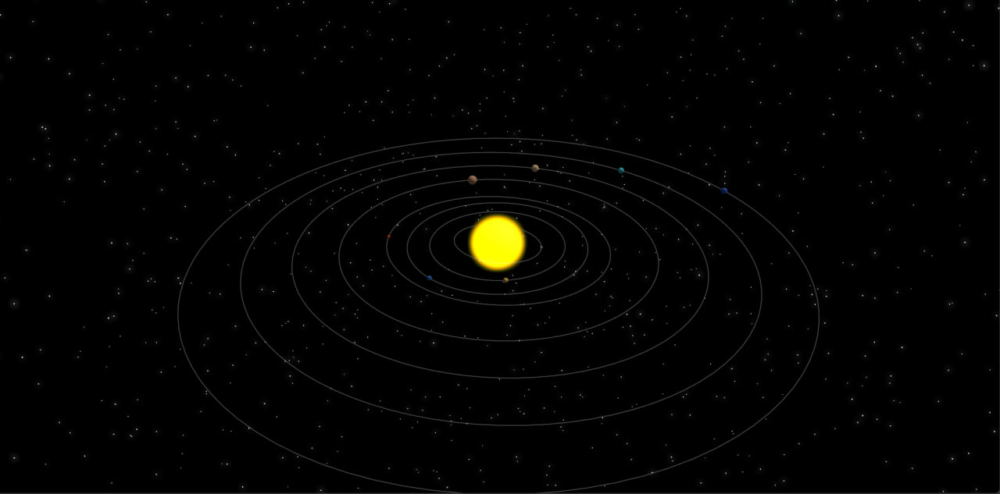

# Solar System Simulation with React Three Fiber

This project is a 3D simulation of a solar system built using **React Three Fiber**, a React renderer for **Three.js**.
It demonstrates how to create interactive 3D scenes with reusable components, animations, and realistic lighting.

 <!-- Add a screenshot if available -->

## Features

- **3D Planets**: Render planets with customizable sizes, colors, and positions.
- **Elliptical Orbits**: Simulate elliptical orbits with adjustable radius and eccentricity.
- **Dynamic Lighting**: Use ambient and point lights to create a realistic space environment.
- **Reusable Components**: Modular design with reusable React components for planets, orbits, and the sun.
- **Smooth Animations**: Leverage React Three Fiber's animation loop for smooth transitions.

## Technologies Used

- [React Three Fiber](https://docs.pmnd.rs/react-three-fiber/getting-started/introduction) - A React renderer for
  Three.js.
- [Three.js](https://threejs.org/) - A 3D graphics library for the web.
- [TypeScript](https://www.typescriptlang.org/) - For type-safe development.
- [Vite](https://vitejs.dev/) - Fast build tool for modern web development.

## Installation

1. Clone the repository:
   ```bash
   git clone 
   ```
2. Navigate to the project directory:
     ```bash 
     cd /path/to/your/folder/
     ```
3. Install dependencies:
    ```bash 
    npm install
    ```
4. Start the development server:
    ```bash
    npm run dev 
    ```
5. Open your browser and visit http://localhost:5173/ to view the project.